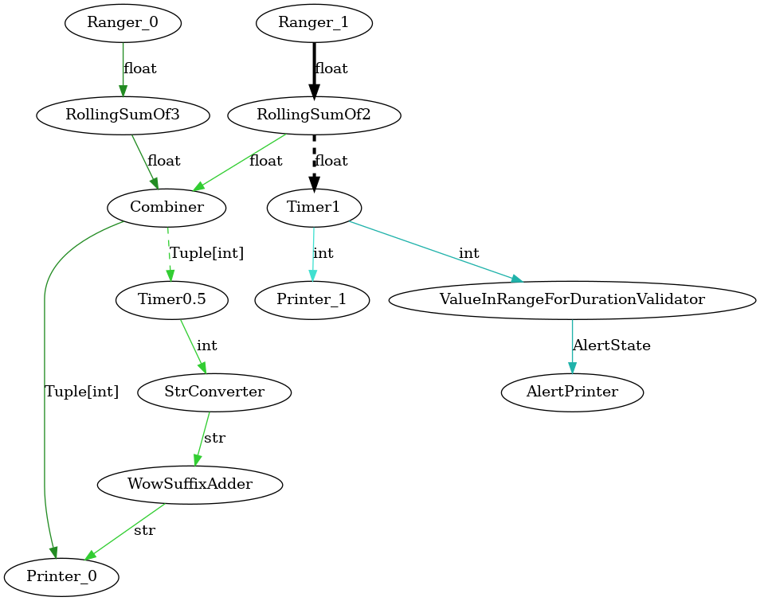

# Python Flow Framework

## Overview

The Python Flow Framework is a modular and asynchronous pipeline framework designed for building data processing workflows. It allows you to create nodes that can process data, connect them in a pipeline, and visualize the flow of data using Graphviz.

# Python Flow Framework

## Description

The Python Flow Framework is a robust and modular system designed for building and managing asynchronous data processing pipelines. It provides a structured way to define nodes that can process data, connect them in a flexible pipeline architecture, and visualize the flow of data using Graphviz. This framework is particularly useful for applications that require efficient data handling, real-time processing, and clear visualization of data workflows.

## Key Features

### 1. **Asynchronous Node Processing**
   - The framework supports asynchronous operations, allowing nodes to process data concurrently. This enhances performance and responsiveness, especially in I/O-bound tasks.

### 2. **Modular Node Design**
   - Nodes are defined as classes that inherit from the `Node` or `AsyncNode` base classes. This modularity allows for easy customization and extension of node functionality.
   - Each node can have specific configurations, such as the type of data it processes, the number of sources and sinks, and logging capabilities.

### 3. **Flexible Pipeline Management**
   - Pipelines can be constructed by connecting multiple nodes, with clear definitions of data flow between them.
   - The framework provides methods to initialize, start, and manage the state of the pipeline, ensuring that nodes are properly connected and executed in the correct order.

### 4. **Dynamic Source and Sink Management**
   - Nodes can dynamically set their sources and sinks, allowing for flexible data routing. This is particularly useful for complex workflows where data may need to be redirected based on certain conditions.

### 5. **State Management**
   - The framework includes a state management system for both nodes and pipelines, allowing users to track the current state (e.g., RUNNING, WAITING, HIBERNATING) and handle transitions appropriately.

### 6. **Logging and Monitoring**
   - Integrated logging capabilities allow for monitoring the behavior of nodes and pipelines. Users can log messages at different severity levels (DEBUG, INFO, WARNING, ERROR, CRITICAL) to track the execution flow and diagnose issues.

### 7. **Graph Visualization**
   - The framework includes utilities to visualize the data flow using Graphviz. Users can generate graphical representations of their pipelines, making it easier to understand and communicate the structure and flow of data.

### 8. **Error Handling and Robustness**
   - The framework is designed to handle errors gracefully, providing clear error messages and preventing the entire pipeline from failing due to issues in individual nodes.

### 9. **Extensibility**
   - Users can easily extend the framework by creating new node types or modifying existing ones to fit specific processing needs. This flexibility makes it suitable for a wide range of applications, from simple data transformations to complex workflows.

### 10. **Example Use Cases**
   - Data processing pipelines for ETL (Extract, Transform, Load) tasks.
   - Real-time data analysis and processing in applications such as IoT or streaming data.
   - Workflow automation in data science and machine learning projects.

## Installation

To use the Python Flow Framework, ensure you have Python installed, and then install the required packages:

```bash
git clone https://github.com/duck-5/pyflow.git

# Windows:
pip install ./pyflow

# Linux:
pip3 install ./pyflow
```

**To include the visualization utils:**
```bash
# Install the 'graphs' extansion
pip install ./pyflow[graphs]
```

Make sure to have Graphviz installed on your system. You can download it from [Graphviz's official website](https://graphviz.gitlab.io/download/).

## Visualization

The graph generated by the Python Flow Framework visually represents the flow of data between nodes in a pipeline. Each node corresponds to a processing unit, labeled to indicate its function (e.g., "Data Source," "Data Processor"). 

### Key Components:

- **Nodes**: Represent processing units that handle data. Their labels describe their roles in the pipeline.
- **Edges**: Connect nodes and indicate data flow direction. 
  - **Dashed Edges**: Represent asynchronous processing, allowing data to flow without waiting.
  - **Solid Edges**: Indicate synchronous processing, where the source waits for the sink to be ready.
- **Combined Edges**: Thick black edges signify multiple data flows between the same source and sink nodes.

## Examples

Here’s a simple example demonstrating how to create a pipeline with two nodes and visualize it:

```python
import asyncio
from typing import Tuple

from python_flow.base import AsyncPipeline
from python_flow.nodes import (
    AsyncioTimerDataStreamerNode,
    CombineNode,
    MapperNode,
    PrinterNode,
    RangerNode,
    RollingSumNode,
    ValueInRangeForDurationValidatorNode
)

from python_flow.utils import utils

async def main():
    ranger_0 = RangerNode(label="Ranger_0", step=1)
    ranger_1 = RangerNode(label="Ranger_1", step=2)

    rolling_sum_of_3 = RollingSumNode(label="RollingSumOf3", summed_queue_len=3)
    rolling_sum_of_2 = RollingSumNode(label="RollingSumOf2", summed_queue_len=2)
    combiner = CombineNode(label="Combiner", passed_value_type=Tuple[int])
    printer_0 = PrinterNode(label="Printer_0")
    printer_1 = PrinterNode(label="Printer_1")
    value_in_range_validator = ValueInRangeForDurationValidatorNode(
        label="ValueInRangeForDurationValidator", top_limit=300, bottom_limit=100, duration_seconds=2
    )
    alert_printer = PrinterNode(label="AlertPrinter")
    timer_0 = AsyncioTimerDataStreamerNode(
        label="Timer0.5", loop=asyncio.get_event_loop(), timer_interval_seconds=0.5, passed_value_type=int
    )
    timer_1 = AsyncioTimerDataStreamerNode(
        label="Timer1", loop=asyncio.get_event_loop(), timer_interval_seconds=1, passed_value_type=int
    )

    str_converter = MapperNode(label="StrConverter", callback=str, passed_value_type=str)
    wow_suffix_adder = MapperNode(label="WowSuffixAdder", callback=lambda x: x + "wow", passed_value_type=str)

    pipeline_0 = AsyncPipeline(head=ranger_0, middle_nodes=[rolling_sum_of_3, combiner, printer_0])
    pipeline_1 = AsyncPipeline(head=ranger_1, middle_nodes=[rolling_sum_of_2, combiner, timer_0, str_converter, wow_suffix_adder, printer_0])
    pipeline_2 = AsyncPipeline(head=ranger_1, middle_nodes=[rolling_sum_of_2, timer_1, printer_1])
    pipeline_3 = AsyncPipeline(head=ranger_1, middle_nodes=[rolling_sum_of_2, timer_1, value_in_range_validator, alert_printer])
    
    pipelines = [pipeline_0, pipeline_1, pipeline_2, pipeline_3]
    utils.initialize_all_pipelines(pipelines)
    utils.render_graphviz_graph(pipelines, label="main_graph")
    await utils.async_start_pipelines(pipelines)

if __name__ == "__main__":
    loop = asyncio.new_event_loop()
    loop.create_task(main())
    loop.run_forever()
```

The above script will generate a visual representation of the pipeline in a PNG format. The output image will show the flow of data between the nodes.



## Usage

1. **Define Your Nodes**: Create classes that inherit from `AsyncNode` and implement the `_start` method for processing.
2. **Create a Pipeline**: Instantiate `AsyncPipeline` with your nodes.
3. **Initialize and Start**: Call `initialize()` and `start()` methods to run the pipeline.
4. **Visualize**: Use the `render_graphviz_graph` function to create a visual representation of your pipeline.

## Contributing

Contributions are welcome! Please feel free to submit a pull request or open an issue for any enhancements or bug fixes.

## License

This project is licensed under the MIT License. See the LICENSE file for more details.
