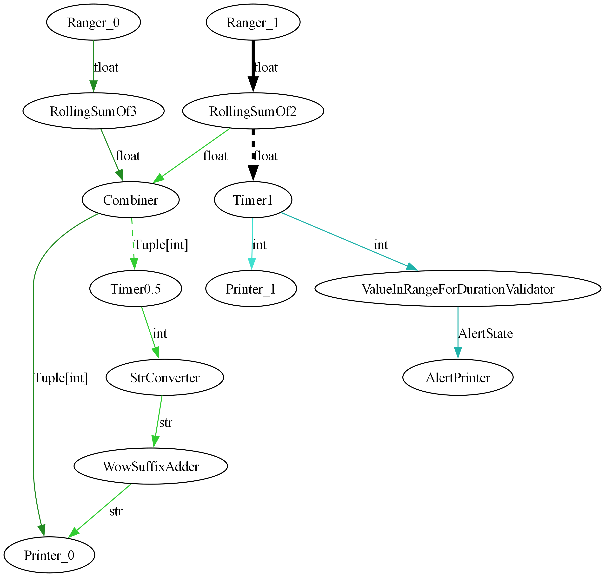

# Python Flow Framework

## Overview

The Python Flow Framework is a modular and asynchronous pipeline framework designed for building data processing workflows. It allows you to create nodes that can process data, connect them in a pipeline, and visualize the flow of data using Graphviz.

## Features

- **Asynchronous Node Processing**: Supports asynchronous operations for efficient data handling.
- **Flexible Node Configuration**: Nodes can be configured with various parameters, including sources and sinks.
- **Pipeline Management**: Easily manage and execute pipelines with initialization and state management.
- **Graph Visualization**: Generate visual representations of the data flow using Graphviz.

## Installation

To use the Python Flow Framework, ensure you have Python installed, and then install the required packages:

```bash
pip install graphviz
```

Make sure to have Graphviz installed on your system. You can download it from [Graphviz's official website](https://graphviz.gitlab.io/download/).

## Examples

### Example Script
Here’s a simple example demonstrating how to create a pipeline with two nodes and visualize it:

```python
import asyncio
from typing import Tuple

from python_flow.base import AsyncPipeline
from python_flow.nodes import (
    AsyncioTimerDataStreamerNode,
    CombineNode,
    MapperNode,
    PrinterNode,
    RangerNode,
    RollingSumNode,
    ValueInRangeForDurationValidatorNode
)

from python_flow.utils import utils

async def main():
    ranger_0 = RangerNode(label="Ranger_0", step=1)
    ranger_1 = RangerNode(label="Ranger_1", step=2)

    rolling_sum_of_3 = RollingSumNode(label="RollingSumOf3", summed_queue_len=3)
    rolling_sum_of_2 = RollingSumNode(label="RollingSumOf2", summed_queue_len=2)
    combiner = CombineNode(label="Combiner", passed_value_type=Tuple[int])
    printer_0 = PrinterNode(label="Printer_0")
    printer_1 = PrinterNode(label="Printer_1")
    value_in_range_validator = ValueInRangeForDurationValidatorNode(
        label="ValueInRangeForDurationValidator", top_limit=300, bottom_limit=100, duration_seconds=2
    )
    alert_printer = PrinterNode(label="AlertPrinter")
    timer_0 = AsyncioTimerDataStreamerNode(
        label="Timer0.5", loop=asyncio.get_event_loop(), timer_interval_seconds=0.5, passed_value_type=int
    )
    timer_1 = AsyncioTimerDataStreamerNode(
        label="Timer1", loop=asyncio.get_event_loop(), timer_interval_seconds=1, passed_value_type=int
    )

    str_converter = MapperNode(label="StrConverter", callback=str, passed_value_type=str)
    wow_suffix_adder = MapperNode(label="WowSuffixAdder", callback=lambda x: x + "wow", passed_value_type=str)

    pipeline_0 = AsyncPipeline(head=ranger_0, middle_nodes=[rolling_sum_of_3, combiner, printer_0])
    pipeline_1 = AsyncPipeline(head=ranger_1, middle_nodes=[rolling_sum_of_2, combiner, timer_0, str_converter, wow_suffix_adder, printer_0])
    pipeline_2 = AsyncPipeline(head=ranger_1, middle_nodes=[rolling_sum_of_2, timer_1, printer_1])
    pipeline_3 = AsyncPipeline(head=ranger_1, middle_nodes=[rolling_sum_of_2, timer_1, value_in_range_validator, alert_printer])
    
    pipelines = [pipeline_0, pipeline_1, pipeline_2, pipeline_3]
    utils.initialize_all_pipelines(pipelines)
    utils.render_graphviz_graph(pipelines, label="main_graph")
    await utils.async_start_pipelines(pipelines)

if __name__ == "__main__":
    loop = asyncio.new_event_loop()
    loop.create_task(main())
    loop.run_forever()
```

### Visualization

The above script will generate a visual representation of the pipeline in a PNG format. The output image will show the flow of data between the nodes.



## Usage

1. **Define Your Nodes**: Create classes that inherit from `AsyncNode` and implement the `_start` method for processing.
2. **Create a Pipeline**: Instantiate `AsyncPipeline` with your nodes.
3. **Initialize and Start**: Call `initialize()` and `start()` methods to run the pipeline.
4. **Visualize**: Use the `render_graphviz_graph` function to create a visual representation of your pipeline.

## Contributing

Contributions are welcome! Please feel free to submit a pull request or open an issue for any enhancements or bug fixes.

## License

This project is licensed under the MIT License. See the LICENSE file for more details.
